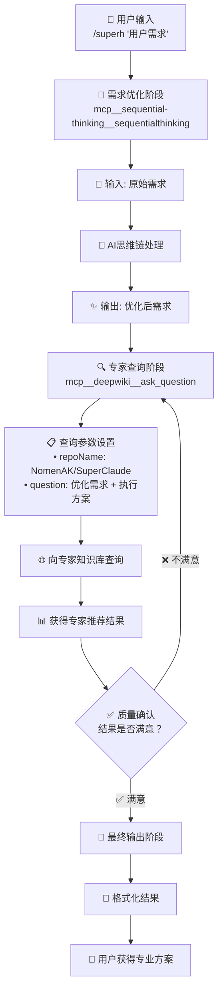

# CLAUDE.md

This file provides guidance to Claude Code (claude.ai/code) when working with code in this repository.

## 项目概述

这是一个SuperClaude命令智能推荐器项目（SuperHelper），主要功能是分析用户需求并推荐合适的SuperClaude命令组合，而不执行具体任务。一个SuperClaude的外挂。
SuperClaude项目地址:https://github.com/NomenAK/SuperClaude.git

## 项目结构

```
superhelper/
├── README.md                      # 项目主要说明文档
├── docs/
│   ├── ARCHITECTURE.md            # 架构说明（5阶段流程图）
│   ├── USER_GUIDE.md              # 使用指南
│   └── PLAN.md                    # 开发计划
├── backup/
│   └── superh.md                  # 核心命令推荐逻辑（5阶段智能流程）
└── CLAUDE.md                      # 项目内部说明文档
```

**架构简化说明**：
- ✅ **极简架构**：专注核心功能，移除不必要的目录
- ✅ **核心依赖**：仅依赖superh.md + deepwiki专家知识库
- ✅ **零冗余**：去除本地知识库维护机制
- ✅ **外挂本质**：SuperHelper作为SuperClaude的增强命令

## 核心架构（标准5阶段流程）

### 5阶段智能优化流程


### 主要组件
- **superh.md**: 核心命令推荐逻辑，实现5阶段智能优化流程
- **deepwiki MCP工具**: SuperClaude专家顾问，提供最新命令信息和推荐
- **sequential-thinking**: 智能需求分析和优化引擎
- **质量审核机制**: 确保推荐准确性

**角色分工清晰**：
- **deepwiki**: SuperClaude专家顾问（主要工作者）
- **SuperHelper**: 质量审核员 + 用户体验优化师（质量把关）
- **SuperClaude**: 实际执行推荐的命令（SuperHelper不执行任务）
- **用户**: 获得准确命令或明确系统限制

### 核心功能
- **专家级推荐**: 基于deepwiki的SuperClaude专业知识
- **质量保证**: 双重验证确保推荐准确性
- **Think Harder引擎**: 自动优化模糊需求，提供精准推荐
- **零妥协准确性**: 追求准确性，不接受"凑合的备选方案"
- **智能场景识别**: 自动判断单命令还是工作流场景

## 开发和维护

### 工具配置
- 项目使用标准Claude Code配置
- 核心工具依赖：
  - **deepwiki MCP工具**: SuperClaude专家顾问，提供最新命令信息
  - **sequential-thinking**: 智能需求分析和优化引擎
  - **graphiti-memory**: 可选，用于记忆用户偏好
- WebFetch限制：仅允许github.com相关域名

### 文档维护
- **superh.md**: 位于backup目录，包含核心推荐逻辑，基于deepwiki专家咨询机制
- **深度依赖deepwiki**: 确保推荐基于最新SuperClaude项目信息
- **质量审核标准**: 维护命令有效性、推荐完整性、用户体验标准
- **错误处理机制**: 完善的deepwiki不可用时的用户指导

### 扩展指南
- **架构极简化**: 避免添加不必要的复杂度和备选方案
- **质量标准更新**: 根据SuperClaude项目更新审核质量标准
- **用户体验优化**: 基于用户反馈改进推荐格式和说明
- **deepwiki集成优化**: 改进专家咨询的提问模板和迭代策略

## 使用模式

### 基本用法
```bash
@superh "项目分析"                    # deepwiki专家推荐
@superh "构建全栈应用"                # 复杂场景工作流推荐
@superh "优化代码"                    # 模糊需求自动优化
```

### 典型场景
- **单命令推荐**: 简单分析、代码审查、快速优化（基于deepwiki专家建议）
- **工作流推荐**: 功能开发、系统重构、全栈开发（deepwiki设计完整流程）
- **Think Harder模式**: 自动优化模糊需求，提供精准推荐
- **质量保证**: 所有推荐都经过质量审核，确保准确性

### 工作原理
1. **用户输入需求** - 描述想要实现的目标
2. **deepwiki专家咨询** - 直接询问SuperClaude专家获取推荐
3. **质量审核** - 验证命令有效性、参数合理性、解释完整性
4. **迭代优化** - 不满意就继续问deepwiki直到获得满意结果
5. **格式化输出** - 按标准格式提供推荐、解释和后续建议

## 系统要求

### 必需工具
- **deepwiki MCP工具**: 核心依赖，提供SuperClaude专家咨询
- **sequential-thinking**: 用于复杂需求分析和优化
- **graphiti-memory**: 可选，用于记忆用户偏好

### 错误处理
- **deepwiki不可用**: 明确告知用户安装和配置要求
- **推荐质量不达标**: 最多尝试3次迭代优化
- **需求不明确**: 引导用户提供更多具体信息

## 技术特点

- **极简架构**: 专注核心功能，避免不必要的复杂度
- **专家级咨询**: 基于deepwiki的SuperClaude专业知识
- **质量保证机制**: 双重验证确保推荐准确性
- **智能需求优化**: Think Harder引擎自动优化模糊需求
- **迭代改进**: 不满意就继续优化直到获得满意结果
- **用户体验优先**: 清晰的错误处理和明确的系统限制说明
- **记忆系统**: Graphiti持久化用户偏好和使用历史

## 重要注意事项

### 设计原则
- **仅推荐，不执行**: SuperHelper只推荐命令，不执行具体任务
- **准确性第一**: 宁可失败也不给错误建议，追求零妥协准确性
- **专家依赖**: 依赖deepwiki专业知识，而非硬编码或猜测
- **极简架构**: 避免过度工程化，专注核心价值

### 维护要点
- **deepwiki依赖**: 确保deepwiki MCP工具正常工作
- **质量标准**: 维护和改进命令有效性审核标准
- **用户体验**: 基于反馈优化推荐格式和错误处理
- **专家咨询优化**: 改进向deepwiki提问的模板和策略

### 安全考虑
- 仅允许特定域名的Web访问
- 限制Bash操作的权限范围
- 不存储敏感信息
- 依赖官方MCP工具，避免自定义安全风险