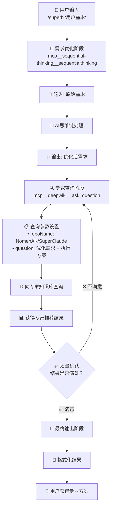

# SuperHelper 架构说明 v2.0

## 项目本质

**SuperHelper是一个SuperClaude的外挂工具**，专门用于分析用户需求并推荐合适的SuperClaude命令组合，而不执行具体任务。

**不是什么**：
- ❌ 复杂的企业级系统
- ❌ 分布式架构
- ❌ 需要部署的服务
- ❌ 本地知识库维护系统
- ❌ 任务执行器

**就是什么**：
- ✅ 一个外挂级别的命令推荐器
- ✅ 5阶段智能优化流程
- ✅ deepwiki专家咨询机制
- ✅ 零妥协准确性保证
- ✅ SuperClaude的专属助手

## 核心架构（标准5阶段流程）



**架构原则**：外挂级专注、零妥协准确！

### 角色分工

- **deepwiki**: SuperClaude专家顾问（主要工作者）
- **SuperHelper**: 质量审核员 + 用户体验优化师（质量把关）
- **用户**: 获得准确命令或明确系统限制
- **SuperClaude**: 实际执行推荐的命令（SuperHelper不执行任何具体任务）

### 文件结构

```
superhelper/
├── .claude/
│   ├── settings.local.json     # Claude Code配置
│   └── commands/
│       └── superh.md           # 核心推荐逻辑（极简版）
├── docs/                       # 项目文档
└── backup/                     # 架构演进备份
```

## 工作原理

### 标准5阶段工作流程

1. **📥 用户需求输入** → 在Claude Code中使用 `@superh "需求描述"`
2. **🧠 需求智能优化** → AI思维链处理，模糊需求转专业需求
3. **🔍 专家知识库查询** → 直接询问SuperClaude专家获取推荐
4. **✅ 质量确认** → 验证命令有效性、参数合理性、解释完整性
5. **📋 格式化输出** → 按标准格式提供推荐、解释和后续建议

### 质量审核标准

```yaml
审核标准:
  命令有效性:
    - 命令是否存在于SuperClaude中？
    - 参数组合是否合理？
    - 语法是否正确？
  
  推荐完整性:
    - 是否充分解释了选择理由？
    - 是否提供了预期效果？
    - 是否有后续步骤建议？
  
  用户体验:
    - 推荐是否匹配用户需求？
    - 复杂度是否适中？
    - 是否有必要的安全提示？
```

### 错误处理机制

```yaml
错误处理策略:
  deepwiki不可用:
    - 明确告知用户安装deepwiki要求
    - 不提供"凑合的备选方案"
    - 提供具体的解决步骤

  推荐质量不达标:
    - 最多尝试3次deepwiki查询
    - 持续迭代直到满意
    - 如仍不满意，告知限制并建议用户澄清需求
```

## MCP工具集成

### 核心依赖

- **deepwiki**: SuperClaude专家顾问（核心依赖）
- **sequential-thinking**: 复杂需求分析和优化
- **graphiti-memory**: 用户偏好记忆（可选）

### 专家咨询模板

```markdown
标准提问模板：
"用户想要[具体需求描述]，请推荐合适的SuperClaude命令和参数组合，并解释：
1. 为什么选择这个命令
2. 为什么选择这些参数
3. 预期效果是什么
4. 建议的后续步骤"
```

## 技术特点

### 架构优势

- **极简设计**: 专注核心功能，避免不必要复杂度
- **专家级咨询**: 基于deepwiki的SuperClaude专业知识
- **质量保证**: 双重验证确保推荐准确性
- **迭代改进**: 不满意就继续优化直到获得满意结果
- **零妥协准确性**: 宁可失败也不给错误建议

### 性能特点

- **准确性**: 基于最新SuperClaude项目信息
- **响应速度**: 取决于deepwiki查询（通常2-5秒）
- **资源占用**: 基本为零（纯Markdown + MCP工具）
- **维护成本**: 极低（主要依赖deepwiki专业知识）

## 架构演进

### v1.0 → v2.0 重大改进

**移除的复杂度**：
- ❌ 本地知识库维护机制
- ❌ 硬编码命令映射
- ❌ 多层容错的复杂逻辑
- ❌ "我重新分析deepwiki结果"的绕圈子流程

**新增的价值**：
- ✅ 直接专家咨询机制
- ✅ 严格的质量审核标准
- ✅ 清晰的错误处理和用户指导
- ✅ 迭代优化直到满意的机制

### 设计哲学变化

**旧哲学**: 多重备选方案，确保总能给出"某种"答案
**新哲学**: 零妥协准确性，要么准确答案要么明确限制

## 扩展指南

### 添加新功能

想要改进SuperHelper？重点关注：

1. **专家咨询优化**: 改进向deepwiki提问的模板和策略
2. **质量标准提升**: 根据用户反馈完善审核标准
3. **用户体验**: 优化推荐格式、错误处理、说明文档
4. **Think Harder引擎**: 改进模糊需求的处理逻辑

### 维护原则

- **保持极简**: 避免添加不必要的复杂度
- **专家依赖**: 依赖deepwiki专业知识，避免硬编码
- **质量第一**: 准确性永远比"总能回答"更重要
- **用户明确**: 清晰的系统限制比模糊的备选方案更好

---

**记住**: SuperHelper v2.0的价值在于**准确的专家级推荐**，不在于复杂的备选机制。专注核心，追求卓越！